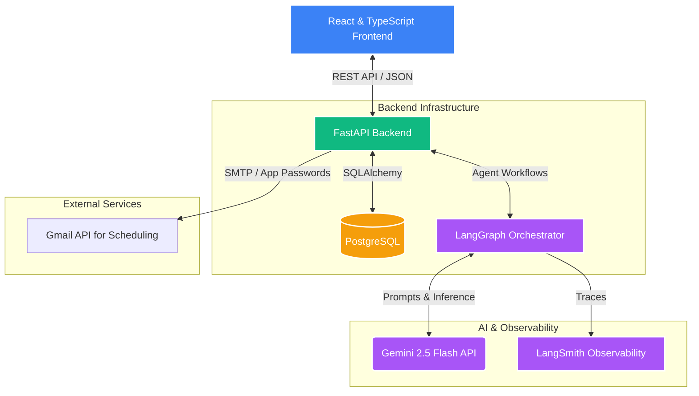

# AI-Powered HR Recruitment Pipeline

This repository hosts an AI-powered HR Recruitment Pipeline built to streamline the hiring process with automated resume ingestion, technical screening, HR dashboard management, and intelligent interview scheduling.

## Architecture



## Technology Choices & Justification

| Technology | Role | Justification |
|------------|------|---------------|
| **React + TypeScript** | Frontend UI | Provides a component-based UI for complex interfaces like dashboards. TypeScript ensures type safety, avoiding runtime errors during candidate data mutations. A bespoke design system provides premium aesthetics. |
| **Python & FastAPI** | Backend API | Essential for seamless integration with modern LLM libraries. FastAPI offers excellent performance, auto-generates Swagger documentation, and natively supports modern asynchronous Python. |
| **LangGraph** | Multi-Agent Framework | Ideal for stateful, cyclic AI workflows. Handles the routing between different capabilities (e.g., resume parsing, interview scheduling, grading) more robustly than basic chain setups. |
| **Gemini 2.5 Flash API** | Foundation LLM | Powerful multimodal model providing top-tier reasoning for candidate interactions with very high speed (low latency for chat usage). |
| **PostgreSQL** | Relational Database | Reliable, ACID-compliant data store crucial for tracking structured candidate schemas, statuses, and HR records with robust integrity. |
| **LangSmith** | Observability | Indispensable for debugging LLM applications. Provides full transparency into agent reasoning steps, latency, and token usage to monitor prompt effectiveness. |
| **Docker** | Containerization | Guarantees environmental parity across developers and reduces the friction of setting up the Python dependency tree, DB, and environment variables. |

## Setup Instructions

### 1. Prerequisites
- Docker & Docker Compose
- Node.js (for local frontend development)
- Python 3.10+ (for local backend development)

### 2. Environment Variables Configuration
In the `HR_Recruitment_Pipeline` directory, locate or create a `.env` file with the essential keys:
```env
# AI Models and Observability
GEMINI_MODEL=gemini-2.5-flash
GOOGLE_API_KEY=your_gemini_api_key_here

LANGSMITH_TRACING=true
LANGSMITH_ENDPOINT=https://eu.api.smith.langchain.com
LANGSMITH_API_KEY=your_langsmith_api_key
LANGSMITH_PROJECT="HR Recruitment Agent System"

# Mail Configuration
SMTP_USER=your_email@gmail.com
SMTP_PASSWORD=your_gmail_app_password
HR_TEAM_EMAIL=your_email@gmail.com
```
*Note: Any `credentials.json` files are safely excluded from version control via `.gitignore`.*

### 3. Running Services via Docker
Start the database and backend services automatically:
```bash
cd HR_Recruitment_Pipeline
docker-compose up -d --build
```
* The backend API will be available at `http://localhost:8000`
* The Swagger Interactive Docs will be at `http://localhost:8000/docs`

### 4. Running the Frontend Locally
```bash
cd HR_Recruitment_Pipeline/frontend
npm i
npm run dev
```
* The React application will be available at `http://localhost:5173`.

### Local Backend Verification
If you wish to run the backend natively without Docker:
```bash
cd HR_Recruitment_Pipeline/backend
python -m venv venv
venv\Scripts\activate
pip install -r requirements.txt
uvicorn app.main:app --reload
```
